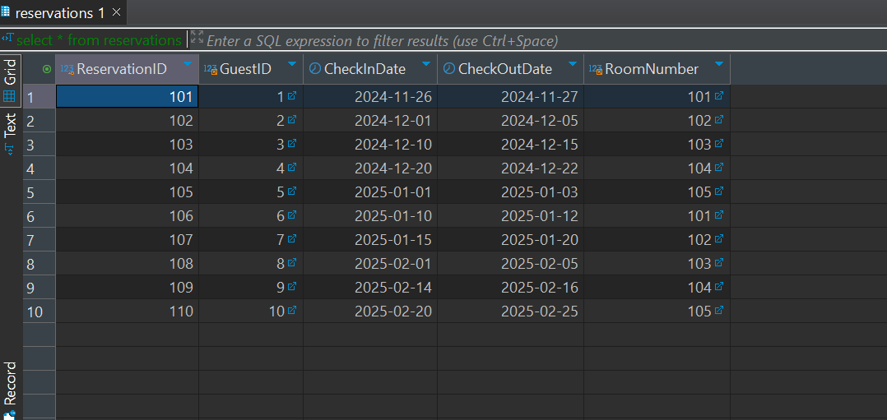
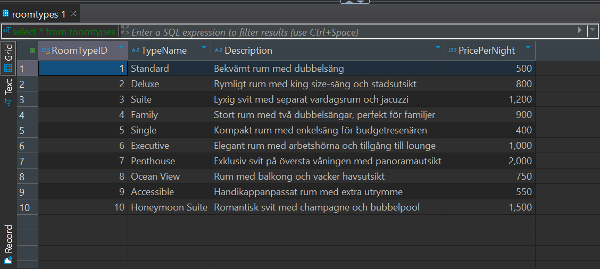
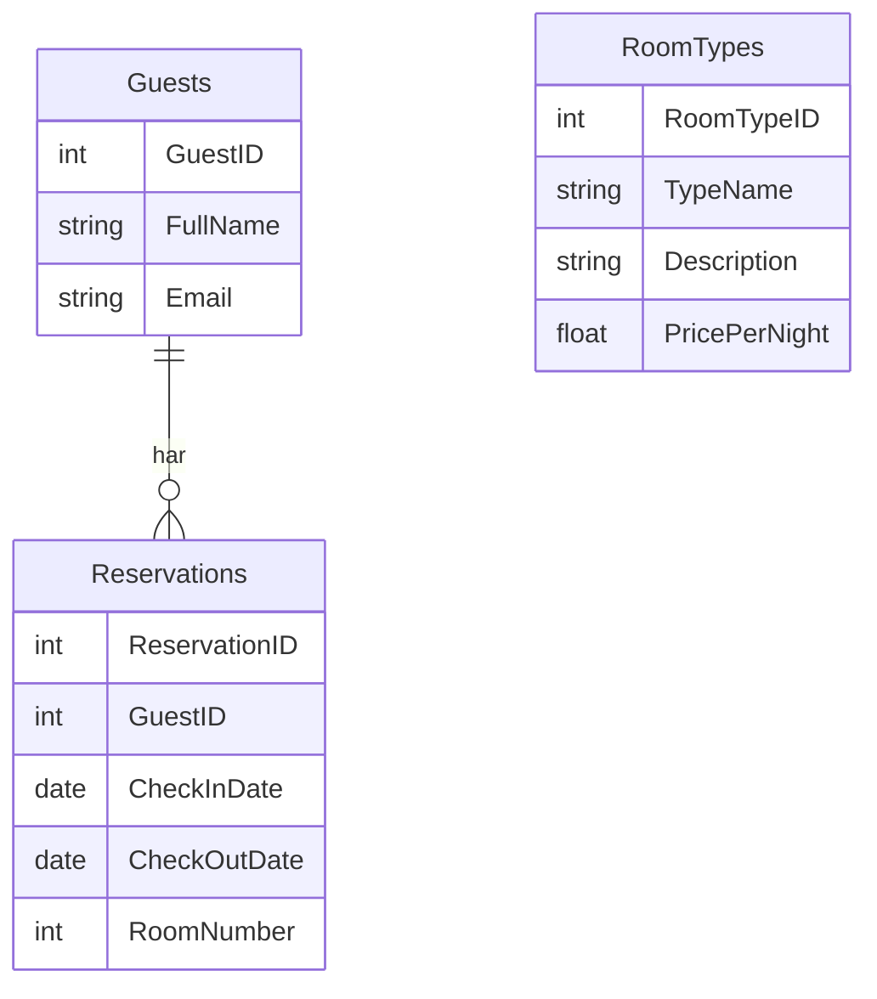
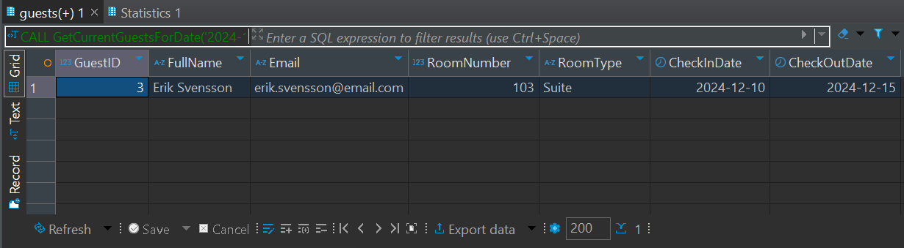
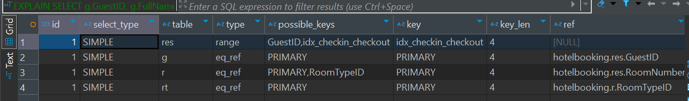

# Databashantering och SQL

## Inledning
Denna uppgift behandlar design, normalisering, implementering och optimering av en hotellbokningsdatabas.

**Grunddel:** Databasdesign, ER-diagram och SQL-frågor.  
**VG-del:** Indexoptimering samt användarhantering och säkerhet.

---

## Del 1: Databasdesign och Implementering

### 1.1 Startschema
```sql
CREATE TABLE Guests (
 GuestID INT PRIMARY KEY,
 FullName VARCHAR(100),
 Email VARCHAR(100)
); 

INSERT INTO Guests (GuestID, FullName, Email) VALUES
(2, 'Anna Andersson', 'anna.andersson@email.com'),
(3, 'Erik Svensson', 'erik.svensson@email.com'),
(4, 'Maria Larsson', 'maria.larsson@email.com'),
(5, 'Johan Bergström', 'johan.bergstrom@email.com'),
(6, 'Lena Nilsson', 'lena.nilsson@email.com'),
(7, 'Karl Lindberg', 'karl.lindberg@email.com'),
(8, 'Sofia Ekström', 'sofia.ekstrom@email.com'),
(9, 'Anders Karlsson', 'anders.karlsson@email.com'),
(10, 'Eva Johansson', 'eva.johansson@email.com');

SELECT * FROM Guests;

CREATE TABLE Reservations (
 ReservationID INT PRIMARY KEY,
 GuestID INT,
 CheckInDate DATE, 
 CheckOutDate DATE,
 RoomNumber INT,
 FOREIGN KEY (GuestID) REFERENCES Guests(GuestID)
);

INSERT INTO Reservations (ReservationID, GuestID, CheckInDate, CheckOutDate, RoomNumber) VALUES
(102, 2, '2024-12-01', '2024-12-05', 102),
(103, 3, '2024-12-10', '2024-12-15', 103),
(104, 4, '2024-12-20', '2024-12-22', 104),
(105, 5, '2025-01-01', '2025-01-03', 105),
(106, 6, '2025-01-10', '2025-01-12', 101),
(107, 7, '2025-01-15', '2025-01-20', 102),
(108, 8, '2025-02-01', '2025-02-05', 103),
(109, 9, '2025-02-14', '2025-02-16', 104),
(110, 10, '2025-02-20', '2025-02-25', 105);

SELECT * FROM Reservations;
```



### 1.2 Utbyggnad och Design
```sql
CREATE TABLE RoomTypes (
 RoomTypeID INT PRIMARY KEY,
 TypeName VARCHAR(50),
 Description TEXT,
 PricePerNight DECIMAL(10, 2)
);

INSERT INTO RoomTypes (RoomTypeID, TypeName, Description, PricePerNight) VALUES
(1, 'Standard', 'Bekvämt rum med dubbelsäng', 500),
(2, 'Deluxe', 'Rymligt rum med king size-säng och stadsutsikt', 800),
(3, 'Suite', 'Lyxig svit med separat vardagsrum och jacuzzi', 1200),
(4, 'Family', 'Stort rum med två dubbelsängar, perfekt för familjer', 900),
(5, 'Single', 'Kompakt rum med enkelsäng för budgetresenären', 400),
(6, 'Executive', 'Elegant rum med arbetshörna och tillgång till lounge', 1000),
(7, 'Penthouse', 'Exklusiv svit på översta våningen med panoramautsikt', 2000),
(8, 'Ocean View', 'Rum med balkong och vacker havsutsikt', 750),
(9, 'Accessible', 'Handikappanpassat rum med extra utrymme', 550),
(10, 'Honeymoon Suite', 'Romantisk svit med champagne och bubbelpool', 1500);

SELECT * FROM RoomTypes;
```



### 1.3 Normalisering och Visualisering (ER-diagram)



## Del 2: Stored Procedure
```sql
DELIMITER //

CREATE PROCEDURE GetCurrentGuestsForDate(IN checkDate DATE)
BEGIN
    SELECT 
        g.GuestID,
        g.FullName,
        r.RoomNumber
    FROM 
        Reservations res
    JOIN 
        Guests g ON res.GuestID = g.GuestID
    WHERE 
        checkDate BETWEEN res.CheckInDate AND res.CheckOutDate;
END //

DELIMITER ;
```



---

## Del 3: Prestandaanalys och Indexoptimering

### Steg 1: EXPLAIN-analys
```sql
EXPLAIN SELECT 
    g.GuestID,
    g.FullName,
    r.RoomNumber
FROM 
    Reservations res
JOIN 
    Guests g ON res.GuestID = g.GuestID
WHERE 
    '2025-01-15' BETWEEN res.CheckInDate AND res.CheckOutDate;
```



### Steg 2: Implementering av index
```sql
CREATE INDEX idx_checkin_checkout ON Reservations (CheckInDate, CheckOutDate);
```

## Del 4: Användarhantering och säkerhet

### Skapa användare med läsbehörighet
```sql
CREATE USER 'hotel_user'@'localhost' IDENTIFIED BY 'Password123';

GRANT SELECT ON Reservations TO 'hotel_user'@'localhost';
GRANT SELECT ON Guests TO 'hotel_user'@'localhost';

FLUSH PRIVILEGES;
```

---


## Del 4: Användarhantering, Säkerhet och Backup

### Skapa användare med läsbehörighet
```sql
CREATE USER 'hotel_user'@'localhost' IDENTIFIED BY 'Password123';

GRANT SELECT ON Reservations TO 'hotel_user'@'localhost';
GRANT SELECT ON Guests TO 'hotel_user'@'localhost';

FLUSH PRIVILEGES;
```

### Backup och återställning av databas
**Backup (exportera databasen):**
```bash
mysqldump -u root -p hotel_db > backup.sql
```

**Simulerat haveri (exempel):**
```sql
DROP DATABASE hotel_db;
```

**Återställning från backup:**
```bash
mysql -u root -p hotel_db < backup.sql
```
Kommentar: Med `mysqldump` skapar vi en säkerhetskopia av databasen. Efter en simulerad förlust (DROP DATABASE) kan vi återställa den till sin tidigare form.

---

## Projektrapport

### Sammanfattning av arbetet
Jag har byggt upp en relationsdatabas för ett hotellbokningssystem med tre tabeller: Guests, Reservations och RoomTypes. Databasen är normaliserad till tredje normalform och representeras i ett ER-diagram med hjälp av Mermaid.

### Del 1 – Databasdesign och SQL
Startade med ett grundschema för Guests och Reservations. Därefter utökades databasen med en RoomTypes-tabell som kopplar till rumsinformation. Jag skrev SQL-skript för att skapa och fylla alla tabeller med data. SELECT-frågor har testats och verifierats.

### Del 2 – Stored Procedure
Jag skapade en stored procedure som returnerar alla gäster som befinner sig på hotellet ett visst datum. Den använder en JOIN mellan Guests och Reservations samt WHERE-sats med datumintervall.

### Del 3 – Prestandaanalys
Med hjälp av EXPLAIN analyserades en SELECT-fråga som filtrerar på datum. Jag implementerade ett sammansatt index på CheckInDate och CheckOutDate för att förbättra prestanda. Förbättringen syns i EXPLAIN-resultatet.

### Del 4 – Säkerhet och Backup
En användare med begränsade rättigheter skapades. Jag visade hur man gör backup och återställning med `mysqldump`, samt hur man återställer efter ett simulerat databashaveri.

### Reflektion
Jag har lärt mig att strukturera en relationsdatabas från grunden, tillämpa normalisering, skriva effektiva SQL-frågor, analysera prestanda och implementera säkerhetsåtgärder. Det var väldigt praktisk och lärorik.

---

