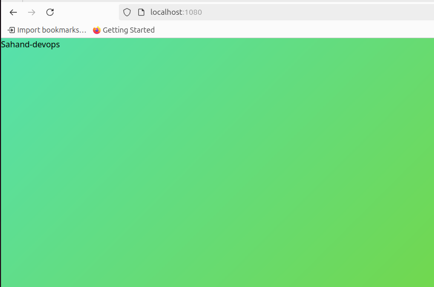

# installation.md

## Steg 1 – Installera Apache

Jag installerade Apache HTTP Server på Ubuntu med följande kommandon:

```bash
sudo apt update
sudo apt install apache2 -y
```
Jag verifierade att Apache körde korrekt:
```
sudo systemctl status apache2
```

## Steg 2 - Klona GitHub-repo och kopiera index.html
Jag klonade mitt repo från GitHub med SSH:
```
git clone git@github.com:nackc8/l11-apache-d4-Sahand-devops.git
cd l11-apache-d4-Sahand-devops
```
Sedan kopierade jag index.html till Apache-webbmapp:
```
sudo cp index.html /var/www/html/index.html
```
## Steg 3 – Ersätta Username med GitHub-användarnam
Jag använde sed för att ersätta platsmarkören Username med mitt GitHub-namn Sahand-devops:
```
sudo sed -i 's/Username/Sahand-devops/g' /var/www/html/index.html
```
## Steg 4 – NAT och port 1080
Eftersom jag använder NAT-läge i VirtualBox kunde jag inte nå servern direkt.
Jag satte därför upp portvidarebefordran:
Värdport: 1080

Gästport: 80

Protokoll: TCP

Därför når jag sidan på:
```
http://localhost:1080
```
## Steg 5 – Verifiering


