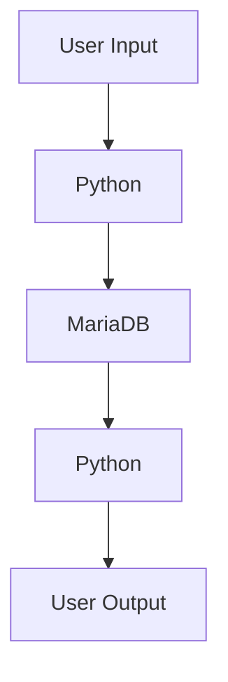

# Teknisk arkitektur
## Python
Koden kommer att skrivas i python. Där kommer funktioner för användaren att hämta samt uppdatera data ifrån databasen
## MariaDB
All data gällande bilar, datum etc kommer lagras i MariaDB som ansluts via Python koden 
## CLI
Programmet körs i CLI där användaren genom input väljer den data som skall hämtas ifrån databasen

